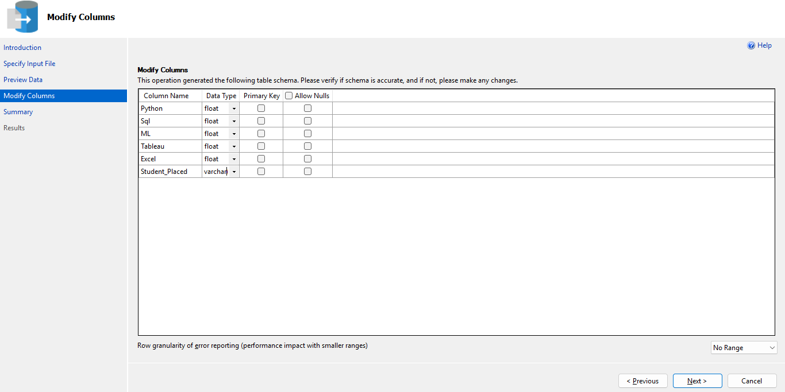
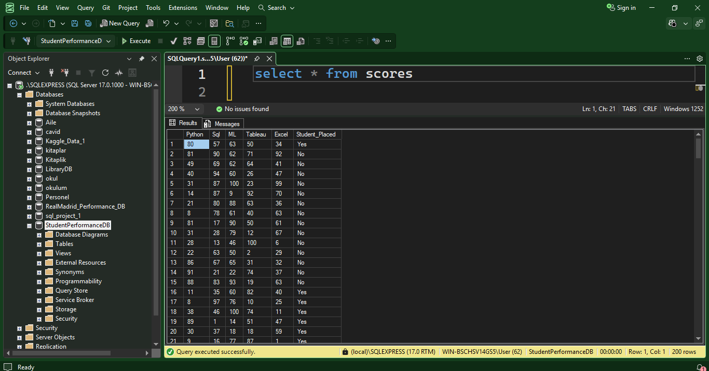
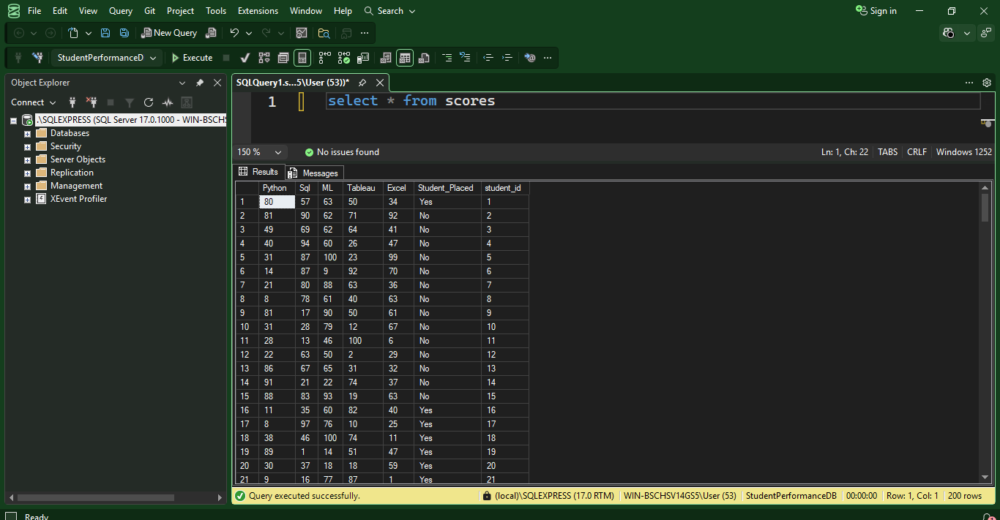
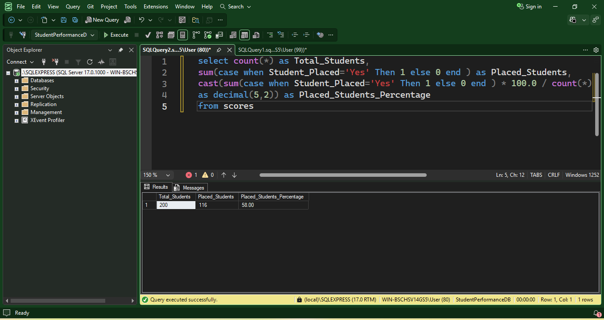
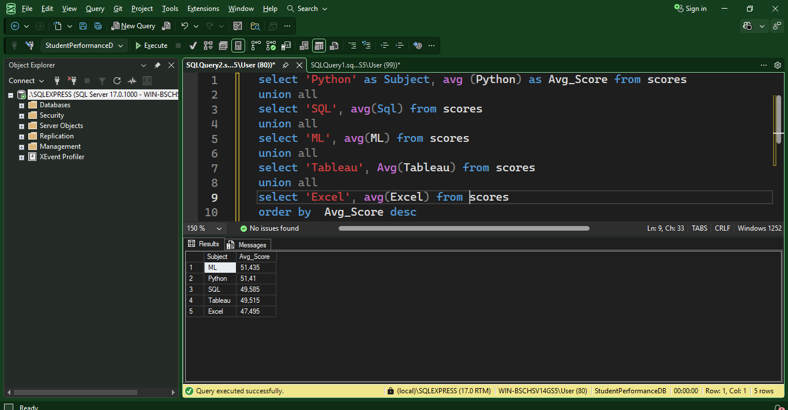
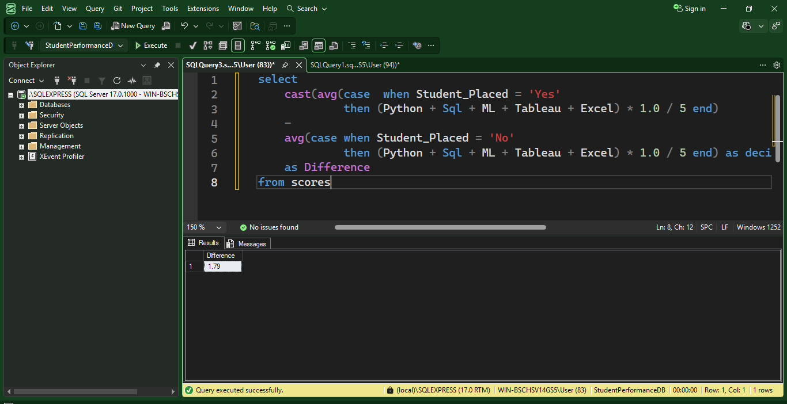
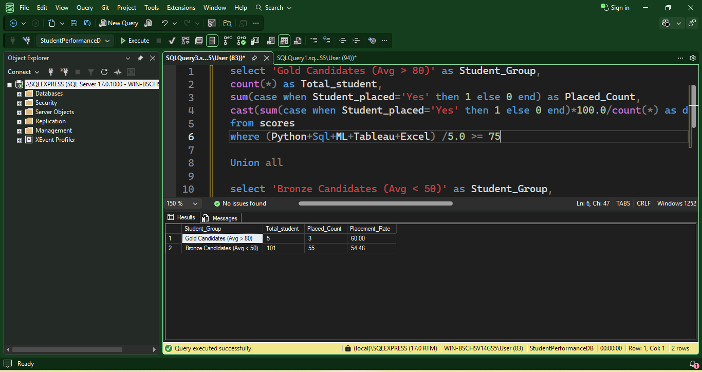
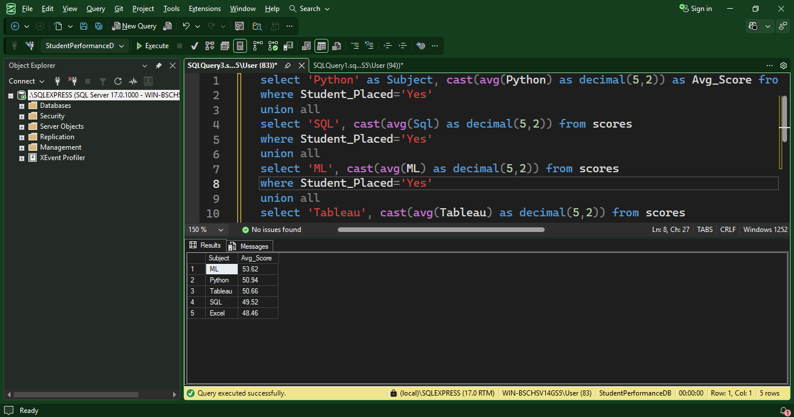
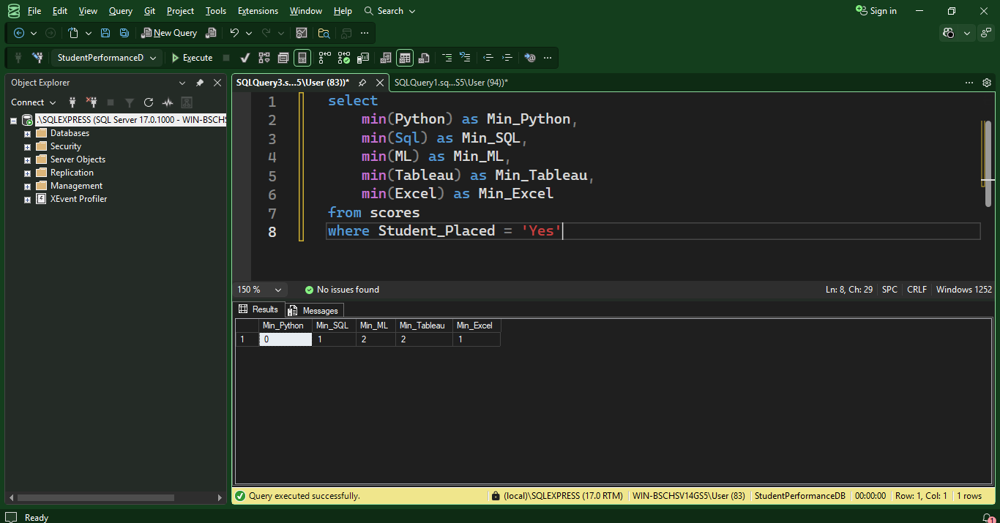

# Recruitment-Insights

A Recruitment Meritocracy Analysis dashboard built using SQL Server for data processing and Power BI for visualization. The project audits recruitment data to analyze the correlation between technical test scores and final hiring outcomes.

#### Database: SQL Server (Data Cleaning & Aggregation)

#### Visualization: Power BI (DAX, Interactive Dashboards)

#### Key Insight: Identifying gaps between technical proficiency and hiring decisions.
## 1.Raw data

## 2.A new database is being created.
```sql
create database StudentPerformanceDB
```
## 3.In the next step, I imported a dataset from Kaggle into SQL Server using the "Import Flat File" feature.

## 4. The data is shown after import. 

## 5. Since the original dataset does not have a unique identifier. 
```sql
ALTER TABLE scores 

ADD student_id INT IDENTITY(1,1) PRIMARY KEY
```

## 6.Overview of Student Placement 
This query calculates the total number of students, the count of placed students, and the overall placement rate. 
```sql
select
count() as Total_Students,
sum(case when Student_Placed='Yes' Then 1 else 0 end ) as Placed_Students,
cast(sum(case when Student_Placed='Yes' Then 1 else 0 end ) * 100.0 / count(*) as decimal(5,2)) as Placed_Students_Percentage
from scores
```

## 7. Performance Analysis by Subject 
This query determines the average score for each subject and ranks them in descending order.
```sql
select 'Python' as Subject, avg (Python) as Avg_Score from scores 
union all 
select 'SQL', avg(Sql) from scores 
union all 
select 'ML', avg(ML) from scores 
union all 
select 'Tableau', Avg(Tableau) from scores 
union all 
select 'Excel', avg(Excel) from scores 
order by  Avg_Score desc
```

## 8. Placement Gap Analysis (The 1.79 Point Difference) 

This query measures the performance gap by comparing the average scores of placed versus non-placed students. The marginal difference of only 1.79 points suggests that scores are not the sole determinant of hiring success in this dataset.
```sql
select  
    cast(avg(case  when Student_Placed = 'Yes'  
             then (Python + Sql + ML + Tableau + Excel) * 1.0 / 5 end) 
    - 
    avg(case when Student_Placed = 'No'  
             then (Python + Sql + ML + Tableau + Excel) * 1.0 / 5 end) as decimal(5,2)) 
    as Difference 
from scores
```

 ## 9. Placement Rate by Performance Segments 

I compared 'Gold' (Avg ≥ 75) and 'Bronze' (Avg < 50) students. The results show a marginal 5.5% difference in placement rates (60% vs 54.4%). This suggests that overall academic averages are not the primary hiring factor, indicating that employers may prioritize specific technical spikes over general academic standing. 
```sql
select 'Gold Candidates (Avg > 80)' as Student_Group,
count(*) as Total_student,
sum(case when Student_placed='Yes' then 1 else 0 end) as Placed_Count,
cast(sum(case when Student_placed='Yes' then 1 else 0 end)100.0/count() as decimal(5,2)) as Placement_Rate
from scores
where (Python+Sql+ML+Tableau+Excel) /5.0 >= 75 

Union all 

select 'Bronze Candidates (Avg < 50)' as Student_Group,
count(*) as Total_student, sum(case when Student_placed='Yes' then 1 else 0 end) as Placed_Count,
cast(sum(case when Student_placed='Yes' then 1 else 0 end)100.0/count() as decimal(5,2)) as Placement_Rate
from scores
where (Python+Sql+ML+Tableau+Excel) /5.0 <50 
```

## 10. I performed a cross-subject average analysis specifically for the placed students. 

Analysis of placed students' scores reveals a 'Competency over Excellence' trend. With average scores hovering around 50 across all subjects, it is evident that the recruitment focus is on baseline technical competency rather than academic mastery. 
```sql
select 'Python' as Subject, cast(avg(Python) as decimal(5,2)) as Avg_Score
from scores  
where Student_Placed='Yes' 

union all  

select 'SQL', cast(avg(Sql) as decimal(5,2))
from scores  
where Student_Placed='Yes' 

union all  

select 'ML', cast(avg(ML) as decimal(5,2))
from scores  
where Student_Placed='Yes' 

union all  

select 'Tableau', cast(avg(Tableau) as decimal(5,2))
from scores  

where Student_Placed='Yes'	 

union all  

select 'Excel', cast(avg(Excel) as decimal(5,2))
from scores  
where Student_Placed='Yes' 
order by  Avg_Score desc
```

## 11. To stress-test the relationship between scores and career outcomes, I conducted a three-step anomaly analysis: 
### 1. Minimum Threshold Check: Identified the absolute lowest scores among placed students to find the entry floor. 
```sql
select  
    min(Python) as Min_Python, 
    min(Sql) as Min_SQL, 
    min(ML) as Min_ML, 
    min(Tableau) as Min_Tableau, 
    min(Excel) as Min_Excel 
from scores 
where Student_Placed = 'Yes'
```

### 2. Low-Score Placement Audit: Filtered for candidates who secured jobs despite scoring near-zero in core subjects like Python and ML. 
```sql
select * from scores
WHERE Python < 5 AND Student_Placed = 'Yes'
```

### 3. High-Score Rejection Audit: Cross-referenced top-performing students against their 'No' placement status to identify logical inconsistencies.(For example: row 15) 
```sql
select * from scores
```

## During my SQL analysis, I found some very strange cases that prove exam scores aren't everything. For example, Student #15 had amazing scores (88 in Python, 83 in SQL, 93 in ML) but was not hired. On the other hand, Student #167 got the job despite scoring only 3 in Python and 6 in ML. 

## This points to two main conclusions: 

### Hidden Factors: Real-world elements like interview performance or past experience might have outweighed the test results. 

### Data Integrity: There is a strong possibility that the dataset itself is inconsistent or synthetic. The lack of a logical correlation between high scores and placement suggests that the data may not reflect real-world hiring logic. As an analyst, recognizing that data can sometimes be unreliable is just as important as the analysis itself. 


