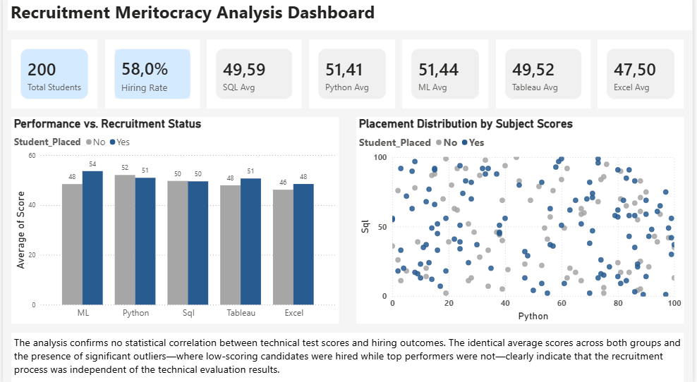
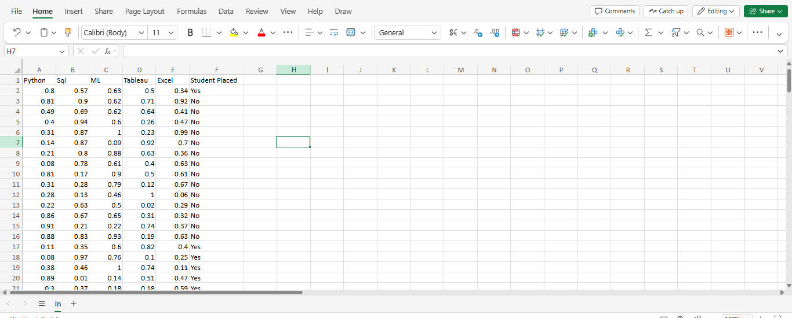

# Recruitment-Insights

A Recruitment Meritocracy Analysis dashboard built using SQL Server for data processing and Power BI for visualization. The project audits recruitment data to analyze the correlation between technical test scores and final hiring outcomes.

#### Database: SQL Server (Data Cleaning & Aggregation)

#### Visualization: Power BI (DAX, Interactive Dashboards)

#### Key Insight: Identifying gaps between technical proficiency and hiring decisions.
## 1.Raw data

## 2.A new database is being created.
```sql
create database StudentPerformanceDB
```

